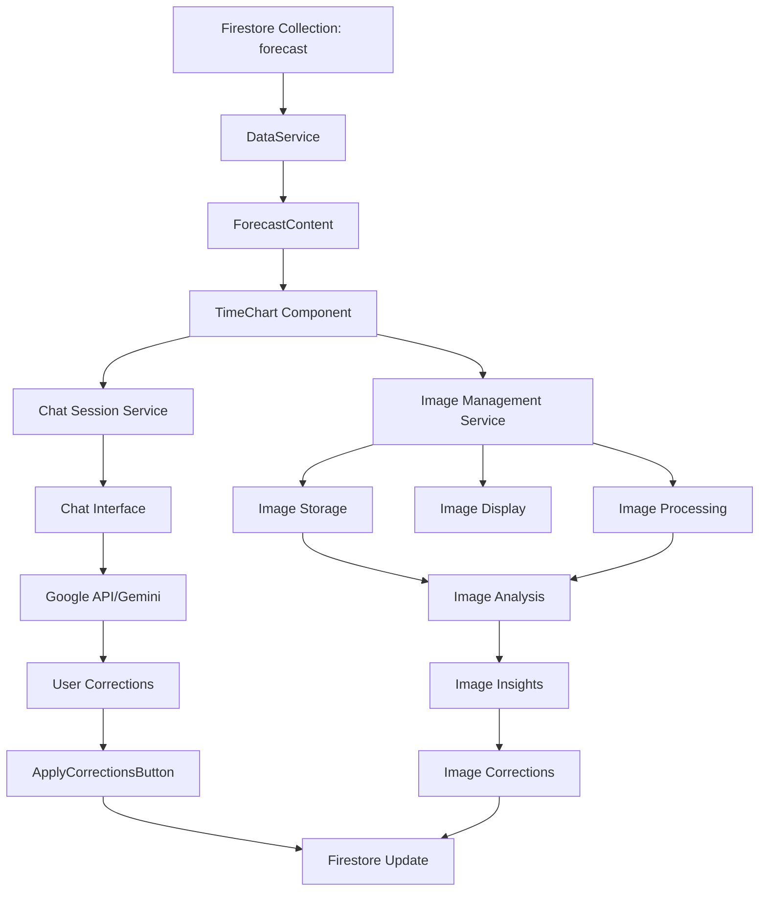
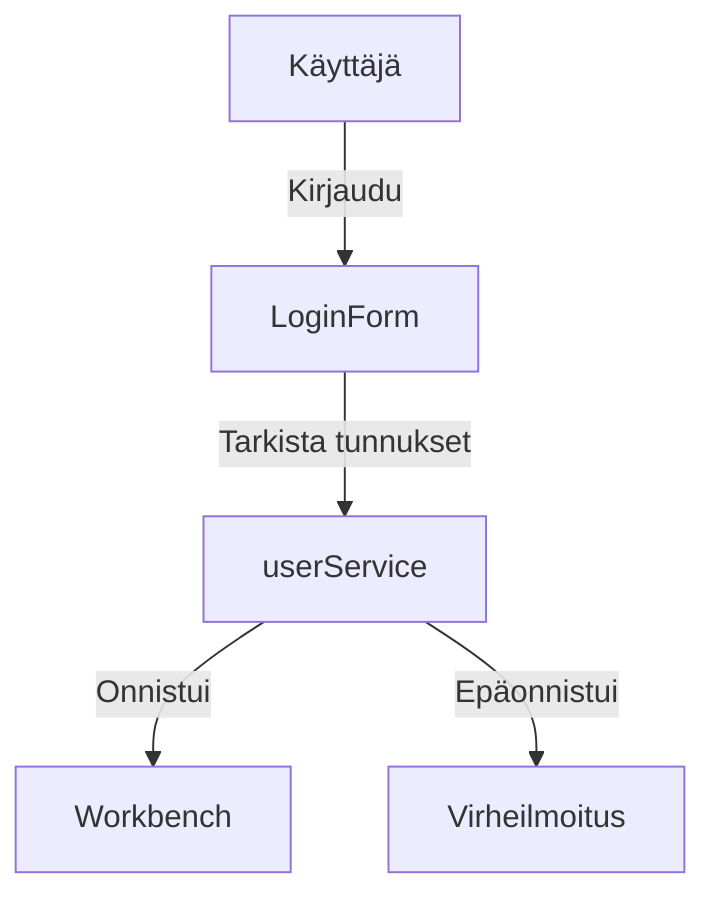
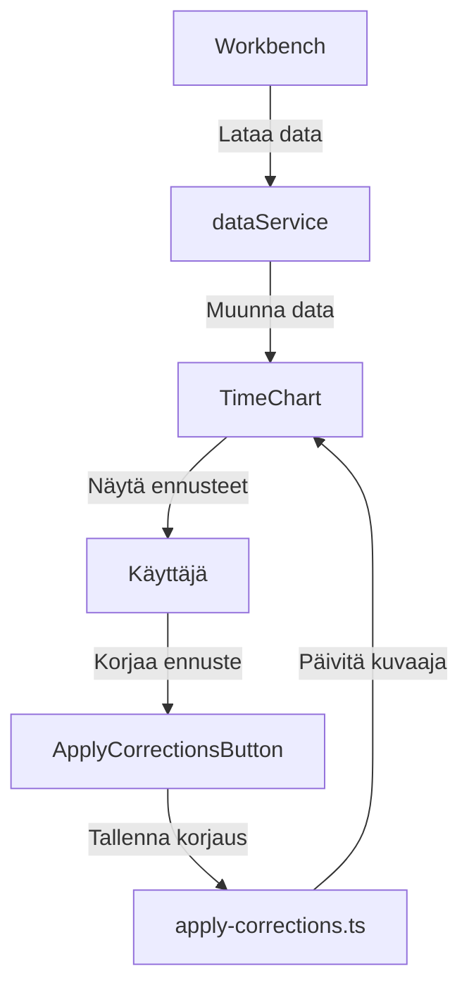
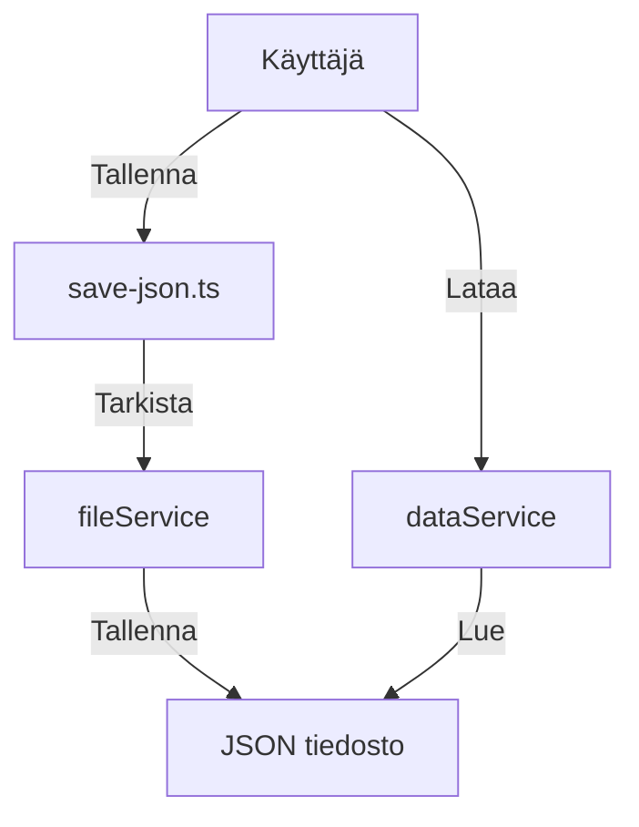

# Data Flow Documentation

This document describes how data flows through the application, from Firestore to charts, through the Google API, and back to Firestore.

## Data Flow Overview



## ASCII Visualizations

### 1. Main Data Flow
```
[Firestore] --> [DataService] --> [UI Components] --> [Chart] --> [Separate Services]
     |              |                  |                |           |
     v              v                  v                v           v
[Raw Data] --> [Normalized] --> [Transformed] --> [Visualized] --> [Image/Chat Services]
```

### 2. Component Interaction
```
+----------------+     +------------------+     +----------------+
|  Firestore     |     |   DataService    |     |    UI Layer    |
|  Collection    | --> |  (Singleton)     | --> |  Components    |
+----------------+     +------------------+     +----------------+
        ^                      |                        |
        |                      v                        v
        |              +------------------+     +----------------+
        |              |  Chart Service   |     |  Image Service |
        |              +------------------+     +----------------+
        |                      |                        |
        |                      v                        v
        |              +------------------+     +----------------+
        |              |  Chat Service    |     |  Image Storage |
        |              +------------------+     +----------------+
        |                      |                        |
        |                      v                        v
        |              +------------------+     +----------------+
        |              |  AI Service      |     |  Image Process |
        |              |  (Gemini)        |     +----------------+
        |              +------------------+             |
        |                      |                        v
        |                      v                +----------------+
        |              +------------------+     |  Image Display |
        |              |  User Input      |     +----------------+
        |              +------------------+
        |                      |
        +----------------------+
```

### 3. Data Transformation Flow
```
[Raw Data in Firestore]
        |
        v
[DataService.loadForecastData()]
        |
        v
[TimeSeriesData Interface]
        |
        v
[Chart Data Points]
        |
        v
[Separate Processing Paths]
        |
        +----------------+----------------+
        |                |                |
        v                v                v
[Chart Image]    [Chat Session]    [Image Analysis]
        |                |                |
        v                v                v
[Image Storage]   [AI Analysis]    [Image Insights]
        |                |                |
        v                v                v
[Image Display]   [User Corrections] [Image Corrections]
        |                |                |
        +----------------+----------------+
                        |
                        v
                [Firestore Update]
```

### 4. State Management Flow
```
+------------------+     +------------------+     +------------------+
|  Initial State   |     |  User Action     |     |  Updated State   |
|  (Firestore)     | --> |  (Corrections)   | --> |  (Firestore)     |
+------------------+     +------------------+     +------------------+
        |                        |                        |
        v                        v                        v
+------------------+     +------------------+     +------------------+
|  Data Loading    |     |  Validation      |     |  Batch Update    |
|  (DataService)   |     |  (ApplyButton)   |     |  (Firestore)     |
+------------------+     +------------------+     +------------------+
        |                        |                        |
        v                        v                        v
+------------------+     +------------------+     +------------------+
|  UI Update       |     |  Chart Refresh   |     |  State Sync      |
|  (Components)    |     |  (TimeChart)     |     |  (DataService)   |
+------------------+     +------------------+     +------------------+
```

### 5. Error Handling Flow
```
[Operation Start]
        |
        v
[Validation Layer]
        |
        v
[Error Check] --> [Error] --> [Error Handler] --> [User Notification]
        |              |              |                  |
        v              v              v                  v
[Success Path]    [Log Error]    [Recovery]        [UI Update]
        |              |              |                  |
        v              v              v                  v
[Continue Flow]   [Error Log]    [Retry/Abort]     [Error State]
```

## Detailed Flow Description

### 1. Data Loading (Firestore → Application)

**Source Files:**
- `src/lib/dataService.ts`
- `src/components/ForecastContent.tsx`

**Flow:**
1. Data is stored in Firestore collection `forecast`
2. `DataService` loads data using Firebase SDK
3. Data is normalized to `TimeSeriesData` interface
4. Components fetch data through `DataService.getInstance()`

**Key Methods:**
```typescript
// DataService.ts
public async loadForecastData(): Promise<TimeSeriesData[]>
public getProductGroupData(group: string): TimeSeriesData[]
public getProductData(productCode: string): TimeSeriesData[]
```

### 2. Chart Visualization and Image Management

**Source Files:**
- `src/components/TimeChart.tsx`
- `src/lib/chartUtils.ts`
- `src/services/imageService.ts`

**Flow:**
1. Data is transformed for chart display
2. `TimeChart` component renders using Recharts
3. Image management service handles:
   - Image storage
   - Image processing
   - Image display
   - Independent image analysis

**Key Components:**
```typescript
// TimeChart.tsx
const TimeChart: React.FC<TimeChartProps>
// chartUtils.ts
export const generateChartImage = (chartData: ChartDataPoint[], title: string)
// imageService.ts
export const ImageService = {
  storeImage: (image: ImageData) => Promise<void>,
  processImage: (image: ImageData) => Promise<ProcessedImage>,
  displayImage: (imageId: string) => Promise<void>,
  analyzeImage: (image: ImageData) => Promise<ImageAnalysis>
}
```

### 3. Chat Session Management

**Source Files:**
- `src/components/ChatInterface.tsx`
- `src/api/chat.ts`
- `src/services/chatSessionService.ts`

**Flow:**
1. Chat session is managed independently of image management
2. User interacts with AI through chat
3. AI analyzes data and provides insights
4. User can make corrections based on AI suggestions

**Key Methods:**
```typescript
// ChatInterface.tsx
const handleSendMessage = async ()
// chat.ts
export const createResponse = async (message: string)
// chatSessionService.ts
export const ChatSessionService = {
  startSession: () => Promise<void>,
  endSession: () => Promise<void>,
  getSessionState: () => SessionState,
  updateSession: (data: SessionData) => Promise<void>
}
```

### 4. Data Correction and Update

**Source Files:**
- `src/components/ApplyCorrectionsButton.tsx`
- `src/lib/dataService.ts`

**Flow:**
1. User applies corrections through UI
2. Corrections are validated
3. Updates are batched and sent to Firestore
4. Local state is updated
5. Chart is refreshed

**Key Methods:**
```typescript
// dataService.ts
public async applyCorrections(corrections: ForecastCorrection[]): Promise<void>
```

## Data Structures

### TimeSeriesData Interface
```typescript
interface TimeSeriesData {
  dates: string[];
  values: number[];
  forecasts: number[];
  corrections: number[];
  prod_class: string;  // Product class identifier (e.g., "Virtalähteet")
}
```

### ChartDataPoint Interface
```typescript
interface ChartDataPoint {
  date: string;
  value: number;
  forecast: number;
  correction: number;
  prod_class: string;  // Product class identifier
}
```

### Database Schema (Firestore)

#### Collection: forecast
```typescript
interface SalesDataDocument {
  // Required fields
  date: string;           // Date of the data point
  value: number;          // Actual sales value
  forecast: number;       // AI-generated forecast
  correction: number;     // User-applied correction
  prod_class: string;     // Product class identifier (e.g., "Virtalähteet")
  
  // Optional fields
  product_id?: string;    // Product identifier
  product_name?: string;  // Product name
  category?: string;      // Product category
  region?: string;        // Sales region
  notes?: string;         // Additional notes or metadata
}
```

### Data Normalization
The system includes a data normalization layer that maps between external and internal data formats:

```typescript
interface DataMapping {
  external: {
    date: string;
    sales: number;
    product: string;
    category: string;
    region: string;
    prod_class: string;
  };
  internal: {
    date: string;
    value: number;
    product_id: string;
    category: string;
    region: string;
    prod_class: string;
  };
}
```

## Color Coding in Charts

| Line Type | Color | Data Field |
|-----------|-------|------------|
| Actual Demand | Blue (#4338ca) | `Quantity` |
| Old Forecast | Green Dotted (#10b981) | `old_forecast` |
| New Forecast | Orange Dotted (#f59e0b) | `new_forecast` |
| Corrected Forecast | Red (#dc2626) | `new_forecast_manually_adjusted` |
| Forecast Error | Red Dotted (#ef4444) | `old_forecast_error` |

## Error Handling

The application implements comprehensive error handling at each stage:

1. **Data Loading**
   - Authentication checks
   - Data validation
   - Error logging

2. **Chart Generation**
   - Null value handling
   - Data transformation validation
   - Canvas context checks

3. **Chat Interface**
   - Session management
   - API error handling
   - Message validation

4. **Data Updates**
   - Batch operation error handling
   - Validation before updates
   - Rollback mechanisms

## Performance Considerations

1. **Data Caching**
   - `DataService` implements singleton pattern
   - Local data caching
   - Batch updates for Firestore

2. **Chart Optimization**
   - Canvas-based image generation
   - Efficient data transformation
   - Responsive chart rendering

3. **Chat Performance**
   - Asynchronous message handling
   - Efficient image processing
   - Session cleanup

## Security

1. **Authentication**
   - Firebase Authentication
   - Protected routes
   - Session management

2. **Data Access**
   - Firestore security rules
   - API key protection
   - Input validation

## Testing

The application includes tests for:
- Data import (`tests/import-sales-data-to-firestore.mjs`)
- Data transformation
- Chart generation
- API integration

## Future Improvements

1. **Data Flow**
   - Real-time updates
   - Offline support
   - Enhanced caching

2. **Visualization**
   - Additional chart types
   - Interactive features
   - Export capabilities

3. **AI Integration**
   - Enhanced analysis
   - More sophisticated corrections
   - Learning from user feedback 

## 1. Autentikaatio


## 2. Ennusteiden käsittely


## 3. Tiedostojen käsittely


## Datarakenne

### Ennustedata
```typescript
interface TimeSeriesData {
  date: string;
  quantity: number;
  old_forecast: number;
  new_forecast: number;
  new_forecast_manually_adjusted: number;
  old_forecast_error: number;
  correction_percent: number;
  explanation: string;
  correction_timestamp: string;
}
```

### Korjausdata
```typescript
interface CorrectionData {
  date: string;
  new_forecast_manually_adjusted: number;
  correction_percent: number;
  explanation: string;
  correction_timestamp: string;
}
```

## Tiedostomuodot

### JSON
```json
{
  "date": "2024-03-20",
  "quantity": 100,
  "old_forecast": 90,
  "new_forecast": 95,
  "new_forecast_manually_adjusted": 105,
  "old_forecast_error": 10,
  "correction_percent": 10.5,
  "explanation": "Korjaus perustuu markkinatietoihin",
  "correction_timestamp": "2024-03-20T12:00:00Z"
}
```

### CSV
```csv
date,quantity,old_forecast,new_forecast,new_forecast_manually_adjusted,old_forecast_error,correction_percent,explanation,correction_timestamp
2024-03-20,100,90,95,105,10,10.5,"Korjaus perustuu markkinatietoihin","2024-03-20T12:00:00Z"
```

## Virheenkäsittely

### Tiedoston käsittely
- Tarkista tiedoston olemassaolo
- Validoi tiedoston muoto
- Käsittele lukuvirheet
- Ilmoita virheet käyttäjälle

### Datan validointi
- Tarkista pakolliset kentät
- Validoi datatyypit
- Tarkista päivämäärien muoto
- Ilmoita virheet käyttäjälle

### API-virheet
- Käsittele verkkoyhteyden virheet
- Ilmoita API-virheet käyttäjälle
- Yritä uudelleen tarvittaessa 

## Image Processing and API Integration

### Image Generation Flow
```
[Chart Data] --> [Canvas/Chart.js] --> [Image Generation] --> [Format Conversion] --> [Base64 Encoding]
     |                |                      |                      |                      |
     v                v                      v                      v                      v
[Raw Values] --> [Visualization] --> [Quality Settings] --> [JPEG/PNG] --> [API Compatible Format]
```

### Image Quality Considerations
1. User View:
   - Original chart rendering
   - Full resolution
   - Interactive elements
   - Real-time updates

2. API View:
   - JPEG format (0.7 quality)
   - Base64 encoded
   - Fixed dimensions
   - Static representation

### Potential Differences
1. Format Conversion:
   - Original → JPEG conversion may affect quality
   - Base64 encoding adds overhead
   - Compression may affect text clarity

2. Processing Steps:
   - Canvas rendering
   - Format conversion
   - Quality adjustment
   - Base64 encoding

### Best Practices
1. Image Generation:
   - Use consistent dimensions
   - Maintain text readability
   - Consider API size limits
   - Monitor quality impact

2. API Integration:
   - Validate image format
   - Check size limits
   - Handle conversion errors
   - Log processing steps

### Monitoring and Debugging
1. Image Processing:
   - Log conversion steps
   - Track quality metrics
   - Monitor size changes
   - Validate output format

2. API Integration:
   - Track API responses
   - Monitor error rates
   - Validate image recognition
   - Log processing times