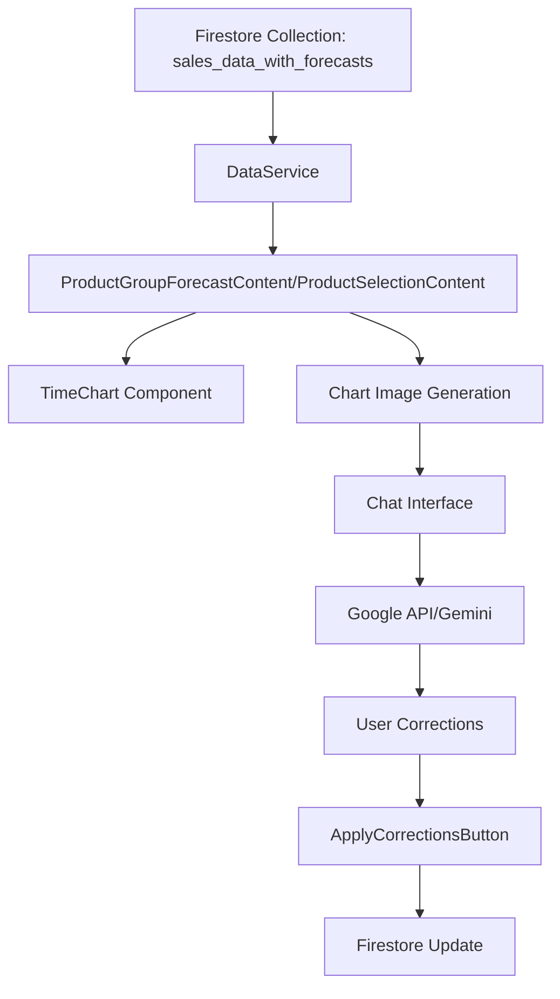

# Data Flow Documentation

This document describes how data flows through the application, from Firestore to charts, through the Google API, and back to Firestore.

## Data Flow Overview



## ASCII Visualizations

### 1. Main Data Flow
```
[Firestore] --> [DataService] --> [UI Components] --> [Chart] --> [Chat] --> [AI] --> [Corrections] --> [Firestore]
     |              |                  |                |           |          |           |              |
     v              v                  v                v           v          v           v              v
[Raw Data] --> [Normalized] --> [Transformed] --> [Visualized] --> [Analyzed] --> [Suggested] --> [Updated] --> [Stored]
```

### 2. Component Interaction
```
+----------------+     +------------------+     +----------------+
|  Firestore     |     |   DataService    |     |    UI Layer    |
|  Collection    | --> |  (Singleton)     | --> |  Components    |
+----------------+     +------------------+     +----------------+
        ^                      |                        |
        |                      v                        v
        |              +------------------+     +----------------+
        |              |  Chart Service   |     |  Chat Service  |
        |              +------------------+     +----------------+
        |                      |                        |
        |                      v                        v
        |              +------------------+     +----------------+
        |              |  Chart Image     |     |  AI Service    |
        |              |  Generation      |     |  (Gemini)      |
        |              +------------------+     +----------------+
        |                      |                        |
        |                      v                        v
        |              +------------------+     +----------------+
        |              |  Corrections     |     |  User Input    |
        |              |  Processing      |     |  Processing    |
        |              +------------------+     +----------------+
        |                      |                        |
        +----------------------+------------------------+
```

### 3. Data Transformation Flow
```
[Raw Data in Firestore]
        |
        v
[DataService.loadCSVData()]
        |
        v
[TimeSeriesData Interface]
        |
        v
[Chart Data Points]
        |
        v
[Chart Visualization]
        |
        v
[Chart Image for Chat]
        |
        v
[AI Analysis]
        |
        v
[User Corrections]
        |
        v
[Updated Data in Firestore]
```

### 4. State Management Flow
```
+------------------+     +------------------+     +------------------+
|  Initial State   |     |  User Action     |     |  Updated State   |
|  (Firestore)     | --> |  (Corrections)   | --> |  (Firestore)     |
+------------------+     +------------------+     +------------------+
        |                        |                        |
        v                        v                        v
+------------------+     +------------------+     +------------------+
|  Data Loading    |     |  Validation      |     |  Batch Update    |
|  (DataService)   |     |  (ApplyButton)   |     |  (Firestore)     |
+------------------+     +------------------+     +------------------+
        |                        |                        |
        v                        v                        v
+------------------+     +------------------+     +------------------+
|  UI Update       |     |  Chart Refresh   |     |  State Sync      |
|  (Components)    |     |  (TimeChart)     |     |  (DataService)   |
+------------------+     +------------------+     +------------------+
```

### 5. Error Handling Flow
```
[Operation Start]
        |
        v
[Validation Layer]
        |
        v
[Error Check] --> [Error] --> [Error Handler] --> [User Notification]
        |              |              |                  |
        v              v              v                  v
[Success Path]    [Log Error]    [Recovery]        [UI Update]
        |              |              |                  |
        v              v              v                  v
[Continue Flow]   [Error Log]    [Retry/Abort]     [Error State]
```

## Detailed Flow Description

### 1. Data Loading (Firestore → Application)

**Source Files:**
- `src/lib/dataService.ts`
- `src/components/ProductGroupForecastContent.tsx`
- `src/components/ProductSelectionContent.tsx`

**Flow:**
1. Data is stored in Firestore collection `sales_data_with_forecasts`
2. `DataService` loads data using Firebase SDK
3. Data is normalized to `TimeSeriesData` interface
4. Components fetch data through `DataService.getInstance()`

**Key Methods:**
```typescript
// DataService.ts
public async loadCSVData(): Promise<TimeSeriesData[]>
public getProductGroupData(group: string): TimeSeriesData[]
public getProductData(productCode: string): TimeSeriesData[]
```

### 2. Chart Visualization

**Source Files:**
- `src/components/TimeChart.tsx`
- `src/lib/chartUtils.ts`

**Flow:**
1. Data is transformed for chart display
2. `TimeChart` component renders using Recharts
3. Chart image is generated for chat interface

**Key Components:**
```typescript
// TimeChart.tsx
const TimeChart: React.FC<TimeChartProps>
// chartUtils.ts
export const generateChartImage = (chartData: ChartDataPoint[], title: string)
```

### 3. Chat Interface and AI Integration

**Source Files:**
- `src/components/ChatInterface.tsx`
- `src/api/chat.ts`

**Flow:**
1. Chart image is sent to chat interface
2. User interacts with AI through chat
3. AI analyzes data and provides insights
4. User can make corrections based on AI suggestions

**Key Methods:**
```typescript
// ChatInterface.tsx
const handleSendMessage = async ()
// chat.ts
export const createResponse = async (message: string)
```

### 4. Data Correction and Update

**Source Files:**
- `src/components/ApplyCorrectionsButton.tsx`
- `src/lib/dataService.ts`

**Flow:**
1. User applies corrections through UI
2. Corrections are validated
3. Updates are batched and sent to Firestore
4. Local state is updated
5. Chart is refreshed

**Key Methods:**
```typescript
// dataService.ts
public async applyCorrections(corrections: ForecastCorrection[]): Promise<void>
```

## Data Structure

### TimeSeriesData Interface
```typescript
interface TimeSeriesData {
  Year_Month: string;
  "Product Group": string;
  "Product code": string;
  "Product description": string;
  Quantity: number | null;
  new_forecast: number | null;
  old_forecast: number | null;
  old_forecast_error: string | null;
  correction_percent?: number | null;
  explanation?: string | null;
  new_forecast_manually_adjusted: number | null;
  correction_timestamp?: string | null;
  id?: string;
}
```

### Chart Data Points
```typescript
interface ChartDataPoint {
  date: string;
  value: number | null;
  old_forecast?: number | null;
  old_forecast_error?: number | null;
  new_forecast?: number | null;
  new_forecast_manually_adjusted?: number | null;
  explanation?: string;
}
```

## Color Coding in Charts

| Line Type | Color | Data Field |
|-----------|-------|------------|
| Actual Demand | Blue (#4338ca) | `Quantity` |
| Old Forecast | Green Dotted (#10b981) | `old_forecast` |
| New Forecast | Orange Dotted (#f59e0b) | `new_forecast` |
| Corrected Forecast | Red (#dc2626) | `new_forecast_manually_adjusted` |
| Forecast Error | Red Dotted (#ef4444) | `old_forecast_error` |

## Error Handling

The application implements comprehensive error handling at each stage:

1. **Data Loading**
   - Authentication checks
   - Data validation
   - Error logging

2. **Chart Generation**
   - Null value handling
   - Data transformation validation
   - Canvas context checks

3. **Chat Interface**
   - Session management
   - API error handling
   - Message validation

4. **Data Updates**
   - Batch operation error handling
   - Validation before updates
   - Rollback mechanisms

## Performance Considerations

1. **Data Caching**
   - `DataService` implements singleton pattern
   - Local data caching
   - Batch updates for Firestore

2. **Chart Optimization**
   - Canvas-based image generation
   - Efficient data transformation
   - Responsive chart rendering

3. **Chat Performance**
   - Asynchronous message handling
   - Efficient image processing
   - Session cleanup

## Security

1. **Authentication**
   - Firebase Authentication
   - Protected routes
   - Session management

2. **Data Access**
   - Firestore security rules
   - API key protection
   - Input validation

## Testing

The application includes tests for:
- Data import (`tests/import-sales-data-to-firestore.mjs`)
- Data transformation
- Chart generation
- API integration

## Future Improvements

1. **Data Flow**
   - Real-time updates
   - Offline support
   - Enhanced caching

2. **Visualization**
   - Additional chart types
   - Interactive features
   - Export capabilities

3. **AI Integration**
   - Enhanced analysis
   - More sophisticated corrections
   - Learning from user feedback 